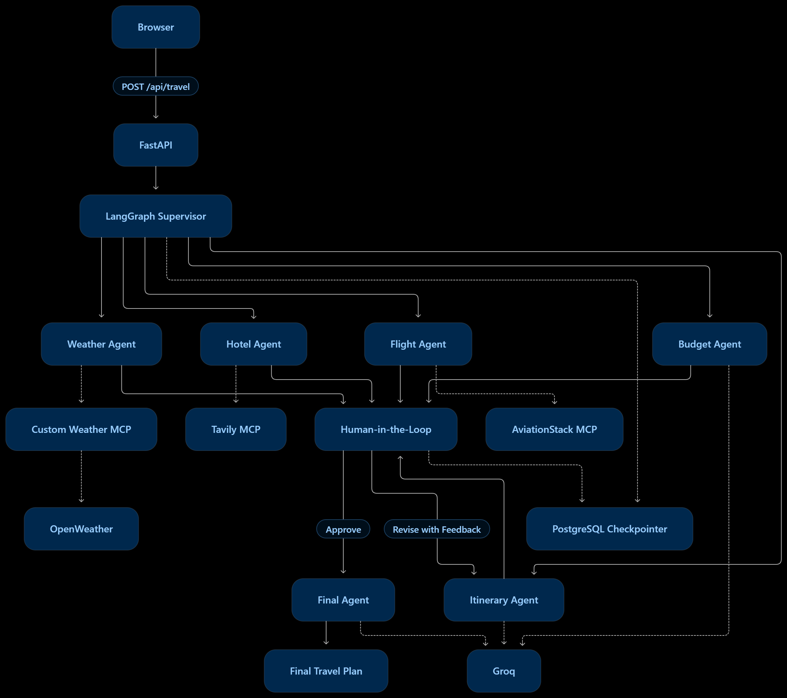

# TripMate AI

TripMate AI is a multi-agent travel planning assistant built around LangGraph and the Model Context Protocol (MCP). Instead of sending every request through one prompt, it uses a supervisor to decide which specialist agents are needed, gathers travel information through MCP-powered tools, creates a draft itinerary, pauses for human review, and then produces the final travel plan.

The project is implemented as a single FastAPI application that serves the web UI and exposes the travel-planning API.

## Live Architecture

External integrations:
- Tavily MCP Server
- AviationStack MCP Server
- Custom Weather MCP Server
- Groq
- PostgreSQL / LangGraph Postgres Checkpointer

## What the Project Solves

Trip planning normally requires switching between multiple sources for flights, hotels, weather, budgets, and itinerary ideas. TripMate turns that into one conversational workflow.

A typical request such as:

\`\`\`text
Plan a 7-day Japan trip under a fixed budget with flights, hotels,
weather and sightseeing.
\`\`\`

goes through several controlled stages instead of directly generating a final answer.

## Core Workflow

### 1. Input Guardrail

The first model-driven step checks whether the request is actually related to travel planning and blocks clearly unrelated or harmful requests.

This prevents the rest of the travel workflow from being used for unrelated tasks.

### 2. Supervisor Agent

The supervisor analyzes the request and selects the specialist agents required for the task.

Available specialists are:

- Flight Agent
- Hotel Agent
- Weather Agent
- Budget Agent
- Itinerary Agent

The supervisor also extracts high-level constraints such as:

- destination
- origin
- duration
- budget
- travel style
- special preferences

The itinerary agent is always included because it is responsible for integrating the specialist results.

### 3. Specialist Agents

#### Flight Agent

Uses the AviationStack MCP integration to retrieve airport and airline information and then asks the Groq model to turn that information into practical flight guidance.

The current implementation focuses on route information, airlines, duration, estimated airfare ranges, peak-season warnings, and booking advice.

#### Hotel Agent

Uses Tavily through MCP to search the web for accommodation recommendations.

#### Weather Agent

Uses a custom local MCP server backed by OpenWeather.

The custom MCP server exposes:

- \`get_current_weather\`
- \`get_forecast\`

This keeps weather-specific API logic isolated behind the MCP tool interface.

#### Budget Agent

Uses the already collected travel context to estimate major cost categories, identify budget risks, suggest savings, and assess feasibility.

The project explicitly asks the model to label values as approximate when live prices are unavailable.

#### Itinerary Agent

Combines the available flight, hotel, weather, and budget information into a draft travel plan.

The draft is intentionally not treated as final yet.

### 4. Human-in-the-Loop Approval

After the draft is created, LangGraph's \`interrupt()\` pauses execution.

The frontend displays the draft and asks the user to either:

- approve it, or
- provide revision feedback.

The workflow can then resume using LangGraph's \`Command(resume=...)\`.

This gives the user a real review point between planning and final generation.

### 5. Final Agent

The final agent generates the polished response using:

- user request
- supervisor constraints
- specialist results
- draft itinerary
- approval decision
- human feedback

The response is structured into:

1. Trip Summary
2. Flight Information
3. Hotel Suggestions
4. Weather Information
5. Day-by-Day Itinerary
6. Estimated Budget
7. Final Recommendations

## MCP Architecture

TripMate uses MCP to separate agent reasoning from external tool integrations.

\`\`\`text
LangGraph Agents
      |
      v
mcp_client.py
      |
      +---- Tavily MCP (remote HTTP)
      |
      +---- AviationStack MCP (stdio / uvx)
      |
      +---- Custom Weather MCP (stdio / Python process)
\`\`\`

### Tavily

The hotel agent calls Tavily through a remote MCP server.

### AviationStack

The flight agent uses an AviationStack MCP package launched through \`uvx\`.

The project expects the \`uvx\` executable to be available at runtime.

### Custom Weather MCP

\`custom_weather_mcp_server.py\` uses FastMCP and exposes weather tools backed by OpenWeather.

The main application starts that MCP server as a stdio subprocess using the same Python environment.

## Persistence

TripMate uses PostgreSQL for LangGraph checkpoint persistence.

The backend creates a \`PostgresSaver\` and calls \`checkpointer.setup()\` before compiling the graph.

A \`thread_id\` identifies a planning conversation, allowing a paused workflow to be resumed after human approval or revision.

The application expects:

\`\`\`env
DATABASE_URL=...
\`\`\`

and automatically adds \`sslmode=require\` when the connection string does not already contain an SSL mode.

## API

### Health Check

\`\`\`http
GET /health
\`\`\`

Returns the service status and enabled workflow features.

### Create / Resume Travel Plan

\`\`\`http
POST /api/travel
Content-Type: application/json

{
  "message": "Plan a 7 day Japan trip...",
  "thread_id": "optional-thread-id"
}
\`\`\`

The response can contain:

- draft itinerary
- \`thread_id\`
- selected agents
- supervisor reasoning
- trip constraints
- specialist results
- \`requires_approval\`

### Approve / Revise Draft

\`\`\`http
POST /api/travel/approve
Content-Type: application/json

{
  "thread_id": "thread-id",
  "approved": true,
  "feedback": ""
}
\`\`\`

For a revision request:

\`\`\`json
{
  "thread_id": "thread-id",
  "approved": false,
  "feedback": "Reduce hotel cost and add a free day."
}
\`\`\`

The backend resumes the paused LangGraph execution from the stored thread.

## Frontend

The UI is intentionally lightweight and is served directly by FastAPI.

\`\`\`text
templates/index.html
static/script.js
static/style.css
\`\`\`

The browser provides:

- travel prompt input
- quick example prompts
- supervisor execution plan
- selected agent display
- draft itinerary review
- approve/revise controls
- Markdown rendering
- copy-to-clipboard
- PDF download
- persistent thread ID through browser local storage

The frontend calls the same FastAPI service, so no separate frontend deployment is required.

## Project Structure

\`\`\`text
TripMate/
├── app.py
├── backend.py
├── mcp_client.py
├── custom_weather_mcp_server.py
├── requirements.txt
├── Dockerfile
├── templates/
│   └── index.html
├── static/
│   ├── script.js
│   └── style.css
├── demo.excalidraw
└── README.md
\`\`\`

### File Responsibilities

| File | Responsibility |
|---|---|
| \`app.py\` | FastAPI application, HTML serving, REST endpoints |
| \`backend.py\` | LangGraph state, supervisor, specialist agents, HITL flow, PostgreSQL checkpointer |
| \`mcp_client.py\` | MCP server configuration and tool access |
| \`custom_weather_mcp_server.py\` | Local FastMCP weather server |
| \`templates/index.html\` | Main web UI |
| \`static/script.js\` | Client-side workflow and API interactions |
| \`static/style.css\` | UI styling |
| \`Dockerfile\` | Containerized deployment |

## Tech Stack

### Backend

- Python 3.11
- FastAPI
- Uvicorn
- Pydantic
- LangGraph
- LangChain
- LangChain Groq
- LangGraph Postgres Checkpoint
- psycopg
- PostgreSQL

### Agent / Tooling

- MCP
- LangChain MCP Adapters
- Tavily MCP
- AviationStack MCP
- FastMCP
- OpenWeather

### AI

- Groq
- \`llama-3.3-70b-versatile\`

### Frontend

- HTML
- CSS
- JavaScript
- Marked.js
- html2pdf.js

### Deployment

- Docker
- Render-compatible container deployment
- PostgreSQL

## Environment Variables

Create a local \`.env\` file with:

\`\`\`env
GROQ_API_KEY=your_groq_api_key
TAVILY_API_KEY=your_tavily_api_key
AVIATION_STACK_API_KEY=your_aviationstack_api_key
OPENWEATHER_API_KEY=your_openweather_api_key
DATABASE_URL=your_postgresql_connection_string
\`\`\`

The code also accepts \`AVIATIONSTACK_API_KEY\` as an alternative environment-variable name.

Never commit the real \`.env\` file or API keys.

## Local Setup

### 1. Clone the repository

\`\`\`bash
git clone https://github.com/dikshaforsure/TripMate.git
cd TripMate
\`\`\`

### 2. Create a virtual environment

Windows:

\`\`\`powershell
python -m venv .venv
.venv\\Scripts\\Activate.ps1
\`\`\`

Linux/macOS:

\`\`\`bash
python3 -m venv .venv
source .venv/bin/activate
\`\`\`

### 3. Install dependencies

\`\`\`bash
pip install -r requirements.txt
\`\`\`

### 4. Install \`uv\`

The AviationStack MCP integration is launched through \`uvx\`, so the runtime environment must contain the uv toolchain.

Verify:

\`\`\`bash
uvx --version
\`\`\`

### 5. Configure environment variables

Create \`.env\` in the repository root and add the required keys.

### 6. Start the application

Development:

\`\`\`bash
uvicorn app:app --reload --host 127.0.0.1 --port 8000
\`\`\`

Or:

\`\`\`bash
python app.py
\`\`\`

Open:

\`\`\`text
http://127.0.0.1:8000
\`\`\`

Health check:

\`\`\`text
http://127.0.0.1:8000/health
\`\`\`

## Deployment

### Recommended: Render with Docker

The repository already contains a Dockerfile, and the application is designed as one deployable FastAPI service.

The Dockerfile:

- uses Python 3.11
- installs system build dependencies
- installs \`requirements.txt\`
- exposes port 8000
- starts Uvicorn on \`0.0.0.0:8000\`

#### Render setup

1. Create a new Web Service on Render.
2. Connect the \`dikshaforsure/TripMate\` GitHub repository.
3. Choose Docker as the runtime.
4. Keep the repository root as the service root.
5. Add the environment variables from the previous section.
6. Create a PostgreSQL database in Render or use another PostgreSQL provider.
7. Set \`DATABASE_URL\` to the PostgreSQL connection string.
8. Deploy.

The container already starts with:

\`\`\`bash
uvicorn app:app --host 0.0.0.0 --port 8000
\`\`\`

For a platform that injects a dynamic \`PORT\`, use:

\`\`\`bash
sh -c 'uvicorn app:app --host 0.0.0.0 --port $PORT'
\`\`\`

### PostgreSQL

The application requires PostgreSQL for LangGraph checkpointing. The database must be reachable from the Render service and must support SSL when required by the provider.

After deployment, verify:

\`\`\`text
GET https://<your-service>.onrender.com/health
\`\`\`

Expected response:

\`\`\`json
{
  "status": "ok",
  "message": "TripMate AI API is running"
}
\`\`\`

## Important Deployment Considerations

### 1. \`uvx\` must exist

The AviationStack MCP integration depends on \`uvx aviationstack-mcp\`.

The current Dockerfile does not explicitly install uv, so add uv to the image before relying on AviationStack in production.

### 2. MCP subprocesses run inside the application container

The custom weather server is started as a local Python subprocess. The deployment environment therefore needs all dependencies from \`requirements.txt\` and access to \`custom_weather_mcp_server.py\`.

### 3. External APIs are required

The full workflow depends on:

- Groq
- Tavily
- AviationStack
- OpenWeather
- PostgreSQL

### 4. The service must stay running

FastAPI hosts the UI, API, and agent workflow in one service. It should be deployed as a continuously running web service, not as a static site.

## Interview-Level Explanation

> TripMate is a multi-agent AI travel planner built with LangGraph and MCP. The user request first passes through an input guardrail and supervisor. The supervisor extracts trip constraints and dynamically selects specialist agents for flights, hotels, weather, budget, and itinerary generation. These agents use MCP integrations such as Tavily, AviationStack, and a custom OpenWeather MCP server to access external tools. The itinerary agent creates a draft, then LangGraph interrupts execution for human approval. The user can approve the draft or provide feedback, and the workflow resumes from the same PostgreSQL-backed thread to generate the final travel plan. The entire application is exposed through FastAPI and can be deployed as a single containerized service.

### Why LangGraph?

LangGraph provides explicit stateful workflow control. This project needs routing, specialist stages, persistence, an interrupt point, and resume semantics rather than a single LLM call.

### Why MCP?

MCP separates tool integration from agent reasoning. Agents can request capabilities such as web search, aviation data, or weather without embedding each provider-specific integration directly inside every agent.

### Why PostgreSQL?

The application uses LangGraph's PostgreSQL checkpointer to persist graph state by \`thread_id\`. This makes the human-approval workflow resumable rather than keeping state only in process memory.

### Why Human-in-the-Loop?

Travel plans can involve meaningful cost and logistical choices. The system therefore creates a draft first and requires explicit user review before generating the final plan.

## Future Improvements

- Add streaming responses for long-running agent workflows
- Add authentication and user-level trip history
- Move MCP subprocess orchestration into dedicated tool services
- Add retries and stronger timeouts around external providers
- Use structured schemas for specialist outputs
- Add observability and tracing for agent execution
- Add automated tests for routing and approval states
- Add real booking and availability integrations where supported
- Install uv explicitly in the production image
- Use a dynamic \`$PORT\` start command for container hosting

## Repository

GitHub: https://github.com/dikshaforsure/TripMate

## License

This project is distributed under the repository's included license.
